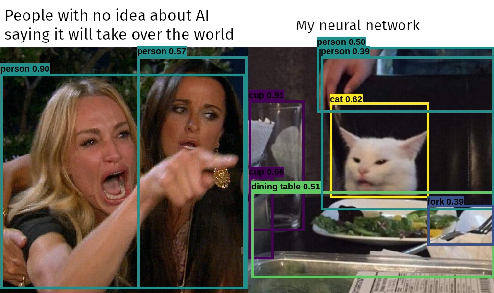

# Hackathon November 2020


Déployer un modèle en production en utilisant FastAPI, Streamlit, Docker & Kubernetes

3 équipes:

- Packaging modèle + Dockerfile
- Réalisation de l'appli companion + Dockerfile
- Déploiement {Google Cloud Run ou GKE} des deux applications

Comment travailler ? 
Comment les équipes communiquent-elles ?

## Yolo-V5



Le modèle: Un détecteur d'objets sur des photographies "standard" supposé marcher en temps réel, qui sort des "bounding boxes" autour des objets détecté dans des images

 
Le papier vaut la lecture

https://pjreddie.com/media/files/papers/YOLOv3.pdf

On récupère la version disponible sur torchhub https://pytorch.org/hub/ultralytics_yolov5/ qui correspond à ceci https://github.com/ultralytics/yolov5

Voici une petite explication de l'historique https://medium.com/towards-artificial-intelligence/yolo-v5-is-here-custom-object-detection-tutorial-with-yolo-v5-12666ee1774e

On se propose ici de wrapper 3 versions du modèle (S,M,L) qui sont 3 versions +/- complexes du modèle YOLO-V5, afin de pouvoir comparer les performances et les résultats

## Planning

09h30: Démarrage, explication du sujet & questions
12h00: Premier point d'avancement
15h00: Deuxième point d'avancement
16h00: Préparation Présentation / Démos
17h00: Démos !

## Mise en place de l'environnement de travail

- Donner l'accès à un seul projet GCP
- Créer une instance de dev par personne (ou binome etc...)
- Se connecter en SSH à cette instance de dev en mappant les ports (vous allez avoir besoin de 8000, 8501 et 80)

### Configuration

Cf [le BE](https://supaerodatascience.github.io/OBD/2_data_computation/site/exercises/4_be.html#objectives-of-this-be)

Le mieux c'est d'avoir google cloud shell d'installé, via linux ou équivalent (windows subsystem for linux pour ceux qui sont sur Windows 1°), afin de pouvoir faire des tunnels SSH en mappant des ports et en faisant des web previews

[Partage de l'accès](https://supaerodatascience.github.io/OBD/2_data_computation/site/exercises/4_be.html#1-share-access-to-projects)

### Création instance de dev

[C'est par là](https://supaerodatascience.github.io/OBD/2_data_computation/site/exercises/4_be.html#2-create-google-compute-engine-vm)

Rappel:
```bash
export INSTANCE_NAME="hackathon-vm" # RENAME THIS !!!!!!!!!!
```

```
gcloud compute instances create $INSTANCE_NAME \
        --zone="europe-west4-a" \
        --machine-type="n1-standard-2" \
        --image-family="common-cpu" \
        --image-project="deeplearning-platform-release" \
        --maintenance-policy=TERMINATE \
        --scopes="storage-rw" \
        --boot-disk-size=50GB
```

### Connection SSH

On se connecte en tant que **jupyter** (important pour l'accès au jupyterlab inclu) en mappant des ports

Vous aurez besoin des ports 8080 (jupyterlab), 8000 (fastapi) et 8501 (streamlit)

[C'est par là](https://supaerodatascience.github.io/OBD/2_data_computation/site/exercises/4_be.html#3-connect-using-ssh-to-the-instance)

```bash
gcloud compute ssh jupyter@{instance} -- \
    -L 8080:localhost:8080 \
    -L 8000:localhost:8000 \
    -L 8501:localhost:8501
```

Ensuite vous pouvez vous rendre sur http://localhost:8080 et vous avez normalement accès à l'interface de jupyterlab avec un éditeur de fichiers et jupyter

Vous pouvez récupérer les fichiers en faisant `git clone https://github.com/fchouteau/isae-gcp-hackathon`

## Liens utiles

https://testdriven.io/blog/fastapi-streamlit/

https://docs.streamlit.io/en/stable/getting_started.html

https://cloud.google.com/kubernetes-engine/docs/tutorials/hello-app
