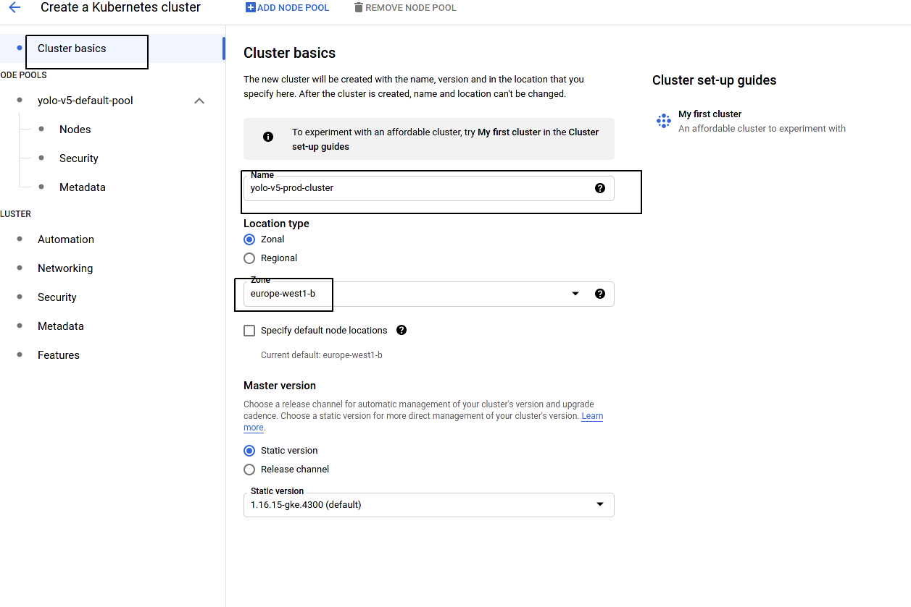
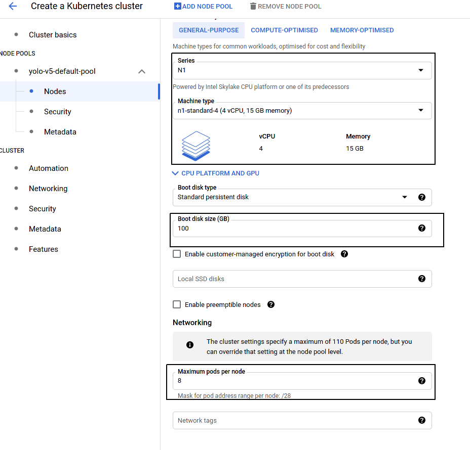
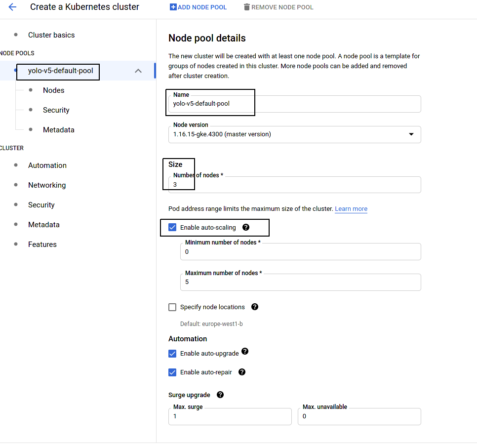
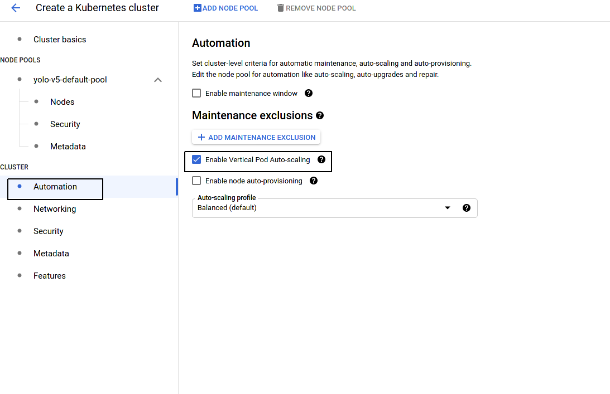

# Team Déploiement

## Objectif

Déployer de façon "scalable" sur google cloud platform les deux applications, s'assurer qu'elles peuvent communiquer

## Déroulement

- S'assurer que les deux images fastapi et streamlit ont été poussées sur le container registry
- Tester localement (via docker compose, en mettant à jour `docker-compose.yml`) les deux images docker et vérifier qu'elles communiquent bien
- Déployer les deux applications sur cloud run / gke

## Docker Compose pour des tests locaux

https://docs.docker.com/compose/

Docker-compose est un utilitaire qui permet de déployer (localement) plusieurs containers dockers et de les faire communiquer entre eux.

Normalement, à ce stade vous avez deux images docker correspondant à l'application streamlit et au modèle.

Editez le fichier `docker-compose.yml` en éditant les noms des images dockers

```yaml
version: '3'
services:
  yolo:
    image: "IMAGE DOCKER YOLO"
    ports:
      - "8000:8000"
    hostname: yolo
  streamlit:
    image: "IMAGE DOCKER STREAMLIT"
    ports:
      - "8501:8501"
    hostname: streamlit
```

Ensuite pour lancer les deux docker simultanément, `docker-compose up`

Les containers sont accessibles depuis les deux ports (8000 et 8501), vous pouvez vous rendre sur `http://localhost:8501` pour accéder à streamlit

POur effectuer les tests, l'ip du cluster à rentrer dans streamlit est `http://yolo:8000` et non pas `localhost:8000` car depuis un container, les autres containers sont accessibles via leur `hostname` (comme une URL)

Pour supprimer les containers ensuite, `docker-compose down` 

## Déploiement sur Google Kubernetes Engine

Rappels de concepts:
https://fchouteau.github.io/isae-cloud-computing-class/2_data_computation/site/lectures/5_orchestration.html#/5
https://kubernetes.io/docs/concepts/

### Création d'un cluster GKE

https://www.redhat.com/en/topics/containers/what-is-a-kubernetes-cluster

- Se rendre sur `Kubernetes Engine`
- Aller dans l'onglet `Cluster`, puis `Create Cluster`
- Suivre ces captures d'écrans pour la création du cluster






### Création de services

https://www.redhat.com/en/topics/containers/what-is-kubernetes-deployment

- Aller dans l'onglet `Workload` puis cliquer sur `Deploy`
- Choisir le container que l'on souhaite déployer (il faudra le faire 2 fois) dans la liste
- Lui donner un nom parlant et `create workload`
- Attendre la fin de la création du service
- Ensuite retourner dans le menu et cliquer sur la workload nouvellement créée
- Normalement vous devez voir des "pods" déployés, mais ils ne sont pas "exposés" donc accessibles
- Dans la section "Exposing services", cliquer sur "Expose"
- Mapper le bon port de l'application sur `:80` (example: Port: 80, Target Port: 8000 pour FastAPI), laisser `Load Balancer`
- Dans l'onglet services, vous devriez maintenant voir votre service exposé avec un "Endpoint", c'est l'URL d'accès

Faites cette manipulation pour les deux applications, puis donnez les deux URLs à quelqu'un pour tester

## Liens Utiles

Docker Compose (tests locaux)
https://docs.docker.com/compose/

Google Cloud Run (serverless managed) - Easier to deploy, harder to control
https://cloud.google.com/run/docs/quickstarts/prebuilt-deploy

Google Kubernetes Engine (managed kubernetes)
https://cloud.google.com/kubernetes-engine/docs/tutorials/hello-app

https://cloud.google.com/kubernetes-engine/docs/how-to/deploying-workloads-overview

https://medium.com/velotio-perspectives/a-practical-guide-to-deploying-multi-tier-applications-on-google-container-engine-gke-5f476805595d

https://cloud.google.com/kubernetes-engine/docs/how-to/exposing-apps
